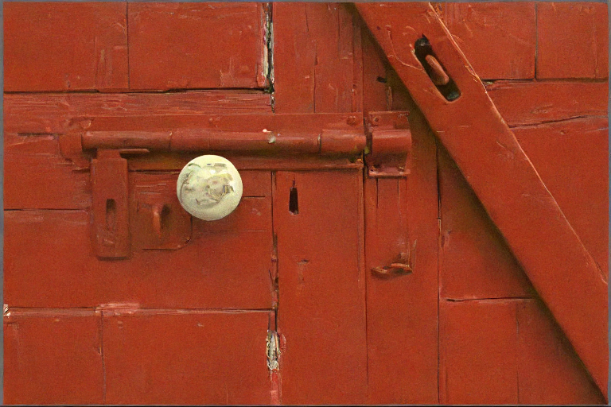
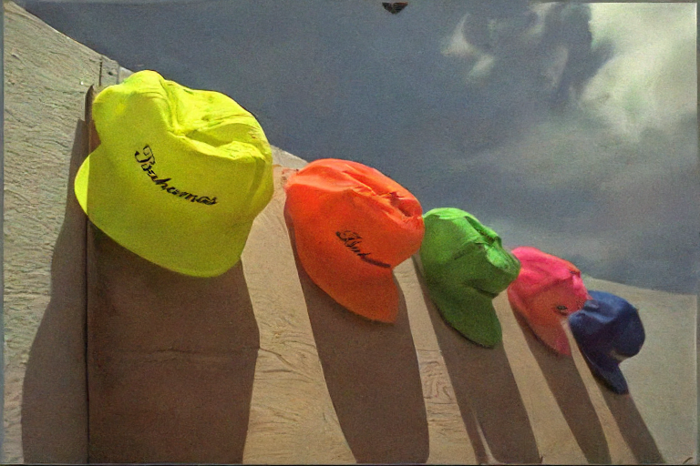

# Diffusion based image coding

This repository was developed starting from the official repo for [Improved Denoising Diffusion Probabilistic Models](https://github.com/openai/improved-diffusion)

# Usage

## Installation

Clone this repository and navigate to it in your terminal. Then run:

```
pip install -e .
pip install torchvision
pip install compressai
pip install wandb
pip install torchmetrics
```

This should install the `improved_diffusion` python package that the scripts depend on.

## Preparing Data

The training code reads images from a directory of image files. In the [datasets](datasets) folder, we have provided instructions/scripts for preparing these directories for ImageNet, LSUN bedrooms, and CIFAR-10.

For creating your own dataset, simply dump all of your images into a directory with ".jpg", ".jpeg", or ".png" extensions. If you wish to train a class-conditional model, name the files like "mylabel1_XXX.jpg", "mylabel2_YYY.jpg", etc., so that the data loader knows that "mylabel1" and "mylabel2" are the labels. Subdirectories will automatically be enumerated as well, so the images can be organized into a recursive structure (although the directory names will be ignored, and the underscore prefixes are used as names).

The images will automatically be scaled and center-cropped by the data-loading pipeline. Simply pass `--data_dir path/to/images` to the training script, and it will take care of the rest.

## Training

We train on ImageNet-1000 but you can use your own dataset.
All of the diffusion parameters are the same you can choose in the original repository e.g. diffusion_steps, noise_schedule, ... however there are some new coding related parameters, for example
- codec: used to specify the codec to use, can be FP, SH or MSH
- encoder_qp: is used to choose which encoder architeture should be loaded based on the qp 
- pretrained_enc: is used to load pretrained weights on the encoder, otherwise the encoder is trained too.
- rho: it is the constant that controls the tradeoff with LPIPS
- final_RD: if the encoder is optimized then this is the rate-distortion tradeoff constant

at this point to train you just need to call the image_train.py script with appropriate parameters, one example is as follows:

```
python scripts/image_train.py --data_dir datasets/imagenet --image_size 128 --num_channels 128 --num_res_blocks 3 --learn_sigma True --dropout 0 --diffusion_steps 4000 --noise_schedule cosine --lr 5e-5 --batch_size 4 --microbatch -1 --use_ddim True --timestep_respacing 1000 --channel_mult 1,2,2,3,3  --encoder_qp 2 --validation_dir datasets/clic --codec MSH --pretrained_enc true --rho 0.9 --max_steps  15e5 --lr_anneal_steps 100000 --final_RD 0.0256 --save_interval 50000 --run_name test --delta 0.05 
```

When training in a distributed manner, you must manually divide the `--batch_size` argument by the number of ranks. In lieu of distributed training, you may use `--microbatch 16` (or `--microbatch 1` in extreme memory-limited cases) to reduce memory usage.

The logs and saved models will be written to a logging directory determined by the `OPENAI_LOGDIR` environment variable. If it is not set, then a temporary directory will be created in `/tmp`.

## Sampling

The above training script saves checkpoints to `.pt` files in the logging directory. These checkpoints will have names like `ema_0.9999_200000.pt` and `model200000.pt`. You will likely want to sample from the EMA models, since those produce much better samples.

Once you have a path to your model, you can generate a large batch of samples like so:

```
python scripts/image_sample.py --model_path logs/MSH_qp_1.pt --image_size 128 --num_channels 128 --channel_mult 1,2,2,3,3 --num_res_blocks 3 --learn_sigma True --dropout 0.0 --diffusion_steps 4000 --noise_schedule cosine --num_samples=24 --timestep_respacing 1000 --data_dir datasets/kodak --batch_size 1 --encoder_qp=1 --codec MSH --use_ddim False
```

You can change the number of sampling steps using the `--timestep_respacing` argument. For example, `--timestep_respacing 250` uses 250 steps to sample. Passing `--timestep_respacing ddim250` is similar, but uses the uniform stride from the [DDIM paper](https://arxiv.org/abs/2010.02502) rather than our stride.

To sample using [DDIM](https://arxiv.org/abs/2010.02502), pass `--use_ddim True`.

Some examples of generated images are reported below

##### Original Images
<table>
  <tr>
    <td> </td>
    <td></td>
    <td></td>
   </tr> 
</table>

##### Standard MSH, qp=2
<table>
  <tr>
    <td> </td>
    <td></td>
    <td></td>
   </tr> 
</table>

#####  Pretrained MSH, qp=2, ddim, 10 steps

<table>
   <tr>
      <td></td>
      <td>
      <td>
  </td>
  </tr>
</table>

#####  Pretrained MSH, qp=2, ddim, 100 steps

<table>
   <tr>
      <td></td>
      <td>
      <td>
  </td>
  </tr>
</table>

#####  Pretrained MSH, qp=2, ddpm, 100 steps
<table>
   <tr>
      <td></td>
      <td>
      <td>
  </td>
  </tr>
</table>
